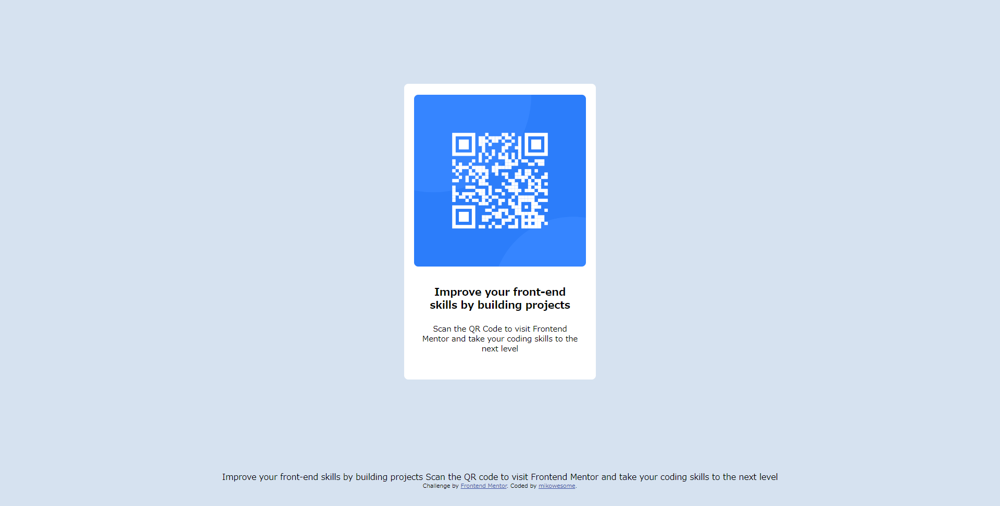

# Frontend Mentor - QR code component solution

This is a solution to the [QR code component challenge on Frontend Mentor](https://www.frontendmentor.io/challenges/qr-code-component-iux_sIO_H). Frontend Mentor challenges help you improve your coding skills by building realistic projects. 

## Table of contents

  - [Screenshot](#screenshot)
  - [Links](#links)
  - [Built with](#built-with)

### Screenshot

### Links

- Solution URL: [Github Link](https://github.com/mikowesome/qr-code-component)
- Live Site URL: [Live Link](https://mikowesome.github.io/qr-code-component/)

### Built with

- HTML5
- CSS3
- Flexbox

